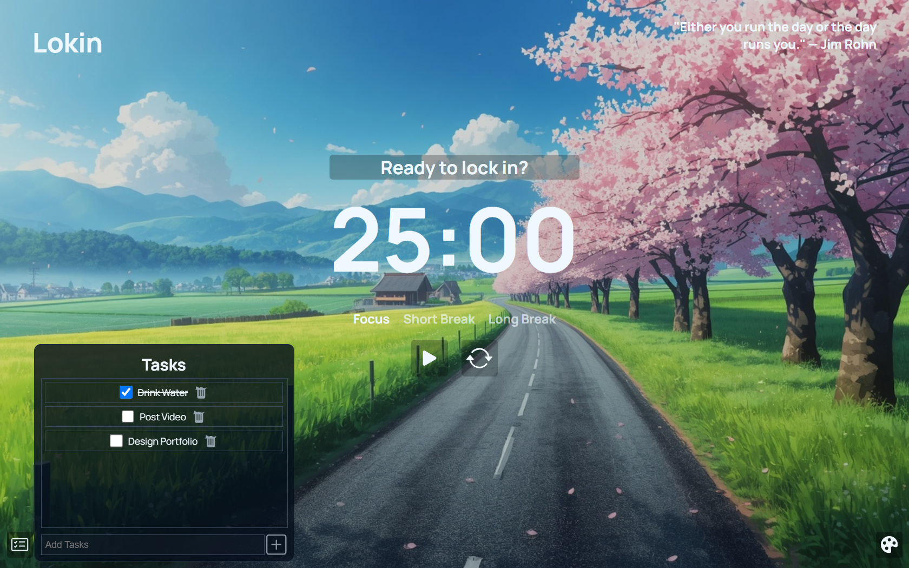
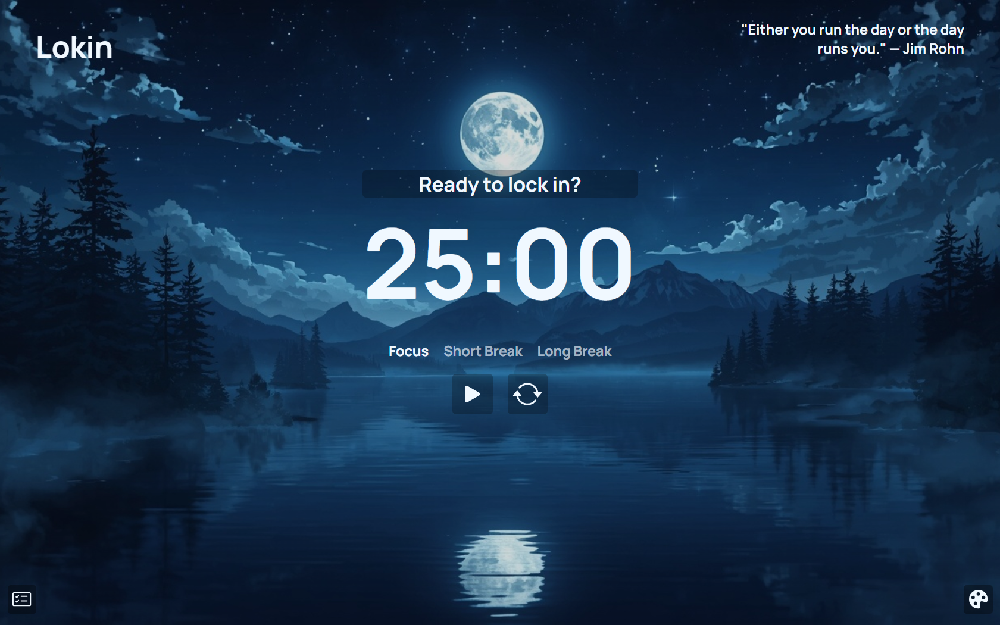

# Lokin
Get set lock-in

## Overview
Lokin in a beautiful and modern workspace that helps you stay organized, manage tasks, and lock in on your work. It combines a focus timer, task management, customizable themes, and a distraction-free interface into one simple workspace.

## Features
- **Focus Timer**: Use the built-in timer to stay focused on your tasks and manage your time effectively.
- **Short/Long Break Timer**: Use the built-in break timers to manage you non-focused time.
- **Task-Management**: Use the built-in task manager to add you daily tasks or the things that you think you will forget, you can also check the task to done and can anytime delete any task.
- **Customizable Themes**: Choose from a variety of themes to customise your workspace and make it your own.

## Tech Stack 
``` HTML ```
``` CSS ```
``` JavaScript ```

## Screenshots 



## Project Structure

```text
Lokin/
├── assets/        # Wallpapers and visual assets
├── index.html     # Main page structure
├── styles.css     # Styling and layout
└── script.js      # Timer, tasks and themes
```

## Getting Started

### Run Locally

You don't need to install anything to run Lokin locally.

1. Clone the repository:

```bash
git clone https://github.com/aridev24/Lokin.git
```

2. Open the project folder.

3. Open `index.html` in your browser.

That's it. Lokin should be ready to use.

## Future Plans

As this is not the final version so there will be many new updates including:

- **Peaceful-Sounds**: Sounds like rain, wind, waterfall, forest, animals, birds, etc that you can select according to your mood. You will also be able to play mutiple sound combinations to set it according to you which let you focus on you work.
- **Settings**: Idea Underdevelopment

## Credits

* [Bootstrap Icons](https://icons.getbootstrap.com/) for the icons used in the interface.
* [Google Fonts](https://fonts.google.com/) for the Manrope font.

## License

This project is licensed under the MIT License.
